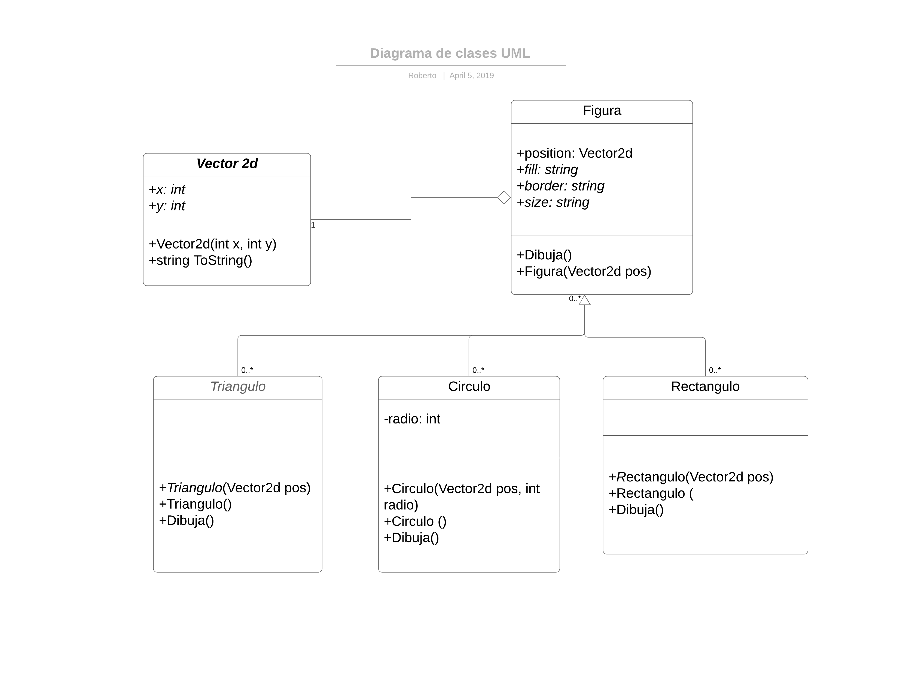

# 
 Herencia

   **Define: Clase Base, Clase Derivada**
1. >Una clase base es aquel que no depende ninguno de sus atributos u objetos de la clase de alguna otra clase, se podría decir en términos de herencia, seria la clase padre, la clase se mantiene fija, en el aspecto de herencia.
2. >Una clase derivada que dependen de las clases bases, ya que algunos de sus métodos son también heredados, y muchas veces, el compilador arroja malos resultados, ya que al ser dependientes estas clases, a veces podrán generar errores lógicos.
---
 ## Haz un diagrama UML donde se muestre la relacion de herencia entre las clases Figura, Rectangulo y Circulo como vimos en clase.**

1. **¿Indica cuales son las clases base y derivadas?**
   >La clase base o padre es `Figura` debido a que de ella derivan las subclases: `Class Circulo`, `Class Rectangulo` y `Class Triangulo`. 

2. **¿Qué es herencia simple y herencia múltiple?**
   >La primera indica que se pueden definir nuevas clases solamente a partir de una clase inicial mientras que la segunda indica que se pueden definir nuevas clases a partir de dos o más clases iniciales. 
3. **¿En C# se puede hacer herencia múltiple?**
   >Basicamente no, solo herencia múltiple de interfaz, esto implica que puedes heredar las declaraciones, pero no las implementaciones.
___

## 5.  Escribe el programa de Figura como vimos en clase, donde agregues varios tipos de figuras a una lista y recorre la lista llamando a un metodo de las figuras, además :
  **5.1 Se sobrecarguen los constructores y se acceda a los constructores de la clase base.**

   **5.2 Explica para que nos sirve la palabra base**
> La palabra clave base se usa para acceder a los miembros de la clase base desde una clase derivada
>
~~~c#
using System;
using System.Collections.Generic;

 class Vector2d
    {
        public int x, y;
        public Vector2d(int x, int y)
        {
            this.x=x; this.y=y;
        }
        public override string ToString()
        {
            return String.Format("{0},{1}", x, y);
        }
    }
    abstract class Figura
    {
        public Vector2d position;
        public string fill ,border,size;

        public Figura():this( new Vector2d(100,100))
        {

        }
        public Figura(Vector2d pos)
        {
            position= pos;
            fill= "white";
            border= "black";
            size = "Grande";
        }

        public abstract void Dibuja();
    }

    class Circulo : Figura
    {
     private int radio;
     public Circulo(Vector2d pos, int radio):base(pos)
     {
         this.radio= radio;
     }
     public Circulo ():base()
     {
         this.radio= 10;
     }

     public override void Dibuja() 
     {
         Console.WriteLine("Se dibuja un circulo en {0} de color {1} con bordes {2} y de tamaño {3}", position, fill,border,size);
     }
    }

    class Rectangulo : Figura
    {

     public Rectangulo(Vector2d pos):base(pos)
     {
     }
     public Rectangulo ():base()
     {
     }

     public override void Dibuja() 
     {
         Console.WriteLine("Se dibuja un Rectangulo en {0} de color {1} con bordes {2} y de tamaño {3}", position, fill,border,size);
     }
    }

    class Triangulo : Figura
    {
     public Triangulo(Vector2d pos):base(pos)
     {
     }
     public Triangulo():base()
     {

     }
     public override void Dibuja() 
     {
         Console.WriteLine("Se dibuja un Triangulo en {0} de color {1} con bordes {2} y de tamaño {3}", position, fill,border,size);
     }
    }
    class Program
    {
        static void Main(string[] args)
        {

            List<Figura> figuras = new List<Figura>();
            figuras.Add(new Circulo());
            figuras.Add(new Rectangulo(new Vector2d(200,200) ));
            figuras.Add(new Triangulo(new Vector2d(50,20)));
            foreach(Figura f in figuras)
            f.Dibuja();
        }
    }
~~~

 **5.3  Haz el método Dibuja() que sea virtual y redefinelo en solo una de las clases derivadas.**

 ~~~c#
 class Vector2d
    {
        public int x, y;
        public Vector2d(int x, int y)
        {
            this.x=x; this.y=y;
        }
        public override string ToString()
        {
            return String.Format("{0},{1}", x, y);
        }
    }
    class Figura
    {
        public Vector2d position;
        public string fill ,border;

        public Figura():this( new Vector2d(100, 100))
        {
        
        }
        public Figura(Vector2d pos)
        {
            position= pos;
            border= "black";
            fill = "Blue";
        }

        public virtual void Dibuja()
        {
            Console.WriteLine("Se Remplaza");
        }

    }

    class Circulo : Figura
    {
     private int radio;
     public Circulo(Vector2d pos, int radio):base(pos)
     {
         this.radio= radio;
     }
     public Circulo ():base()
     {
         this.radio= 10;
     }
     public override void Dibuja() 
     {
         Console.WriteLine("Se dibuja un circulo en {0} de color {1}", position, fill);
     }
    }
 
    class Program
    {
        static void Main(string[] args)
        {
            List<Figura> figuras = new List<Figura>();
            figuras.Add(new Figura());
            figuras[0].Dibuja();
        }
    }
 ~~~